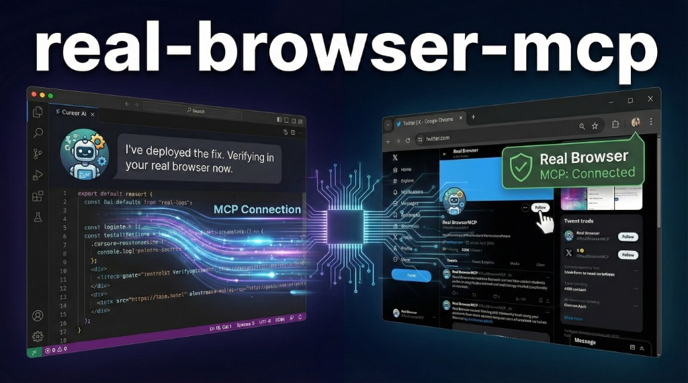

<p align="center">
  
</p>

<h1 align="center">real-browser-mcp</h1>

<p align="center">
  <strong>The missing piece in AI coding: your agent can now see your REAL browser.</strong>
</p>

<p align="center">
  <a href="https://chromewebstore.google.com/detail/real-browser-mcp/fkkimpklpgedomcheiojngaaaicmaidi"></a>
  &nbsp;
  <a href="https://www.npmjs.com/package/real-browser-mcp"></a>
  &nbsp;
  <a href="cursor://anysphere.cursor-deeplink/mcp/install?name=real-browser&config=eyJjb21tYW5kIjoibnB4IiwiYXJncyI6WyIteSIsInJlYWwtYnJvd3Nlci1tY3AiXX0="></a>
  &nbsp;
  <a href="#-teach-your-agent"></a>
</p>

<p align="center">
  <a href="https://github.com/ofershap/real-browser-mcp/actions/workflows/ci.yml"></a>
  <a href="https://www.npmjs.com/package/real-browser-mcp"></a>
  <a href="https://www.npmjs.com/package/real-browser-mcp"></a>
  <a href="https://opensource.org/licenses/MIT"></a>
  <a href="https://www.typescriptlang.org/"></a>
</p>

<p align="center">
  
</p>

---

You ship a fix. Your agent says "done, please verify."
You alt-tab to Chrome, navigate to the page, log in, click around, find the bug.

Your agent just wrote the code. It could also verify it.
It already has your browser open right there. It just can't see it.

Now it can.

<p align="center">
  
</p>

---

## Hosted deployment

A hosted deployment is available on [Fronteir AI](https://fronteir.ai/mcp/ofershap-real-browser-mcp).

## Quick Start

Two parts:

- **MCP server** - runs on your machine, talks to your AI agent
- **Chrome extension** - sits in your browser, executes the commands

### 1. Add the MCP server

**Cursor (one click):**

[](cursor://anysphere.cursor-deeplink/mcp/install?name=real-browser&config=eyJjb21tYW5kIjoibnB4IiwiYXJncyI6WyIteSIsInJlYWwtYnJvd3Nlci1tY3AiXX0=)

Or add manually in Cursor Settings > MCP > "Add new MCP server":

```json
{
  "mcpServers": {
    "real-browser": {
      "command": "npx",
      "args": ["-y", "real-browser-mcp"]
    }
  }
}
```

<details>
<summary>Claude Desktop, Windsurf, or other MCP clients</summary>

**Claude Desktop:** Edit `~/Library/Application Support/Claude/claude_desktop_config.json` (macOS) or `%APPDATA%\Claude\claude_desktop_config.json` (Windows). Add the same JSON block.

**Windsurf:** Settings > MCP. Same config.

Any MCP-compatible client works.

</details>

### 2. Install the Chrome extension

[](https://chromewebstore.google.com/detail/real-browser-mcp/fkkimpklpgedomcheiojngaaaicmaidi)

**Or load from source:**

```bash
git clone https://github.com/ofershap/real-browser-mcp.git
```

1. Open `chrome://extensions` and enable **Developer mode** (toggle in the top right)
2. Click **Load unpacked** and select the `extension/` folder from the cloned repo

Click the Real Browser MCP icon in your toolbar.

Green dot = connected. Gray = waiting for server.

Done. Your agent can see your browser.

---

## How Others Compare

| | Real Browser MCP | Playwright MCP | Chrome DevTools MCP |
|---|---|---|---|
| Uses your existing browser | Yes | No, launches new | Partial, needs debug port |
| Sessions and cookies | Already there | Fresh profile | Manual setup |
| Works behind corporate SSO | Yes | No | Depends |
| Setup | Extension + MCP config | Headless browser | Chrome with `--remote-debugging-port` |

---

## 🧠 Teach Your Agent

The agent can use all 18 tools out of the box, but it works better when it knows _when_ and _how_ to chain them. A config file teaches the right workflow - snapshot first, then act, then verify.

Run one command:

```bash
npx real-browser-mcp --setup cursor
```

This installs:
- `~/.cursor/rules/real-browser-mcp.mdc` - teaches the snapshot-first workflow, how to handle dropdowns, when to use screenshots vs snapshots
- `~/.cursor/commands/check-browser.md` - adds `/check-browser` to your Cursor chat

After that, type `/check-browser` in any chat. Or just say "check the result in my browser" and the agent knows what to do.

<details>
<summary>Claude Code setup</summary>

```bash
npx real-browser-mcp --setup claude
```

Adds an `AGENTS.md` to your project root. Claude Code auto-discovers it.

</details>

See [`agent-config/`](agent-config/) for manual installation or to customize the rules.

---

## What It Can Do

18 tools. Grouped by purpose.

**See**

| Tool | What it does |
|------|-------------|
| `browser_snapshot` | Accessibility tree with element refs. Compact mode (default) returns only interactive elements |
| `browser_screenshot` | Capture what's on screen |
| `browser_text` | Extract raw text from page or element |
| `browser_find` | Query elements by CSS selector |

**Interact**

| Tool | What it does |
|------|-------------|
| `browser_click` | Click by ref or CSS selector |
| `browser_click_text` | Click by visible text. Works through React portals and overlays |
| `browser_type` | Type into inputs and contenteditable fields |
| `browser_press_key` | Key combos (Enter, Escape, Ctrl+A) |
| `browser_scroll` | Scroll pages and virtual containers |
| `browser_hover` | Trigger tooltips and dropdowns |
| `browser_select` | Pick from native `<select>` dropdowns |
| `browser_wait` | Wait for elements to appear or disappear |

**Navigate**

| Tool | What it does |
|------|-------------|
| `browser_navigate` | Go to a URL in the active tab |
| `browser_tabs` | List, create, close, or focus tabs |

**Debug**

| Tool | What it does |
|------|-------------|
| `browser_console` | Console output (log, warn, error) |
| `browser_network` | XHR/fetch requests with status codes |
| `browser_evaluate` | Run JavaScript via Chrome DevTools Protocol |
| `browser_handle_dialog` | Handle alert/confirm/prompt dialogs |

---

## Configuration

| Env var | Default | What it does |
|---------|---------|-------------|
| `WS_PORT` | `7225` | WebSocket port for extension connection |

Connection drops are handled automatically with exponential backoff (1s to 30s), ping/pong health checks every 10s, and per-tool timeouts (5s for clicks, 60s for navigation).

<details>
<summary>Multiple Chrome profiles</summary>

Run two server instances on different ports:

```json
{
  "mcpServers": {
    "browser-work": {
      "command": "npx", "args": ["-y", "real-browser-mcp"]
    },
    "browser-personal": {
      "command": "npx", "args": ["-y", "real-browser-mcp"],
      "env": { "WS_PORT": "9333" }
    }
  }
}
```

Update the port in each extension popup to match.

</details>

---

<details>
<summary><strong>Architecture</strong></summary>

Everything stays on your machine. The extension connects to the MCP server via WebSocket on localhost. No cloud, no proxy, nothing leaves your browser.

```
real-browser-mcp/
├── mcp-server/          MCP server (npm package, TypeScript)
│   └── src/tools/       One file per tool, registry pattern
├── extension/           Chrome extension (Manifest V3, plain JS)
│   ├── background.js    Service worker, WebSocket client, tool handlers
│   ├── content.js       Console capture
│   └── popup/           Connection status UI
├── agent-config/        Pre-built configs for Cursor + Claude Code
│   ├── cursor/          Rules and commands
│   ├── skills/          Browser automation skill
│   └── setup.mjs        One-command installer
└── tests/               Bridge + registry tests
```

**Stack:** TypeScript (strict) · MCP SDK · WebSocket · Chrome Extension Manifest V3 · Vitest

</details>

<details>
<summary><strong>Development</strong></summary>

```bash
git clone https://github.com/ofershap/real-browser-mcp.git
cd real-browser-mcp
npm install
npm run build
npm test
```

| Command | What it does |
|---------|-------------|
| `npm run build` | Compile TypeScript |
| `npm run dev` | Watch mode |
| `npm test` | Run tests |
| `npm run typecheck` | Type check without emitting |
| `npm run setup:cursor` | Install Cursor rule + command |

</details>

## FAQ

<details>
<summary>Does it work with my logged-in sessions?</summary>

That's the whole point. The extension runs inside your actual Chrome - same cookies, same sessions, same local storage. No re-authentication needed.

</details>

<details>
<summary>Does it send data anywhere?</summary>

No. The MCP server and extension talk over WebSocket on localhost. Nothing leaves your machine. There's no analytics, no telemetry, no cloud component. [Privacy policy.](PRIVACY.md)

</details>

<details>
<summary>Which AI clients work?</summary>

Any MCP-compatible client. Cursor, Claude Desktop, Claude Code, Windsurf, Cline, and anything else that speaks the MCP protocol.

</details>

<details>
<summary>Can I use it with multiple Chrome profiles?</summary>

Yes. Run two MCP server instances on different ports. See [Configuration](#configuration) for the setup.

</details>

<details>
<summary>How is this different from Playwright MCP or browser-use?</summary>

They launch a new browser instance from scratch - no state, no cookies, no sessions. You have to replay the full login flow every time. This connects to the browser you already have open with everything already loaded.

</details>

---

## Contributing

Bug reports, feature requests, and PRs welcome. Open an issue first for larger changes.

## Author

[](https://gitshow.dev/ofershap)

[](https://linkedin.com/in/ofershap)
[](https://github.com/ofershap)


---

<sub>README built with [README Builder](https://ofershap.github.io/readme-builder/)</sub>

## License

[MIT](LICENSE) &copy; [Ofer Shapira](https://github.com/ofershap)
