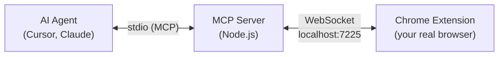

<p align="center">
  
</p>

<h1 align="center">real-browser-mcp</h1>

<p align="center">
  <strong>Your AI agent builds features all day but can't see a single one of them. This fixes that.</strong>
</p>

<p align="center">
  <a href="https://github.com/ofershap/real-browser-mcp/actions/workflows/ci.yml"></a>
  <a href="https://www.npmjs.com/package/real-browser-mcp"></a>
  <a href="https://www.npmjs.com/package/real-browser-mcp"></a>
  <a href="https://opensource.org/licenses/MIT"></a>
  <a href="https://www.typescriptlang.org/"></a>
  <a href="https://chromewebstore.google.com/detail/real-browser-mcp/fkkimpklpgedomcheiojngaaaicmaidi"></a>
</p>

<p align="center">
  <a href="#quick-start"></a>
  &nbsp;
  <a href="#tools"></a>
  &nbsp;
  <a href="#usage-examples"></a>
  &nbsp;
  <a href="#agent-config"></a>
</p>

---

## Have you ever tested what your agent actually built?

Your agent writes code, runs tests, commits. Then says: "Done! Can you verify it looks correct?"

So you switch to the browser. Log in. Navigate three levels deep. Click around. Find out the padding is wrong. Back to the agent. Another fix. Another "please verify." You are the agent's eyes and legs.

The missing piece in AI coding isn't writing code or running tests — it's verifying the result in the browser. Your agent literally cannot see what it built.

That's what this project solves. An MCP server + Chrome extension that connects your agent to the browser you already have open — already logged in, already on the right page, with all your sessions and cookies intact. Not a headless copy. Not a fresh Playwright instance where you'd need to replay your entire auth flow. Your actual browser.

```
You: "Check if the save button works on the settings page"

Agent: *takes snapshot of your open browser tab*
       *finds the save button*
       *clicks it*
       *reads the success message*
       "Save button works. Shows 'Settings saved' and the form resets."
```

---

## Quick Start

You need two things: the MCP server (runs locally, talks to your AI agent) and the Chrome extension (lives in your browser, executes the commands).

### Step 1: Add the MCP server

**Cursor (one click):**

[](cursor://anysphere.cursor-deeplink/mcp/install?name=real-browser&config=eyJjb21tYW5kIjoibnB4IiwiYXJncyI6WyIteSIsInJlYWwtYnJvd3Nlci1tY3AiXX0=)

Or add manually: open Cursor Settings > MCP > "Add new MCP server" and paste:

```json
{
  "mcpServers": {
    "real-browser": {
      "command": "npx",
      "args": ["-y", "real-browser-mcp"]
    }
  }
}
```

<details>
<summary>Claude Desktop, Windsurf, or other MCP clients</summary>

**Claude Desktop:** Edit `~/Library/Application Support/Claude/claude_desktop_config.json` (macOS) or `%APPDATA%\Claude\claude_desktop_config.json` (Windows) and add the same JSON block above.

**Windsurf:** Open Settings > MCP and add the server the same way as Cursor.

Any MCP-compatible client works with the same config.

</details>

### Step 2: Install the Chrome extension

**From the Chrome Web Store (recommended):**

[](https://chromewebstore.google.com/detail/real-browser-mcp/fkkimpklpgedomcheiojngaaaicmaidi)

**Or load from source:**

1. Clone this repo: `git clone https://github.com/ofershap/real-browser-mcp.git`
2. Go to `chrome://extensions`, turn on **Developer mode**
3. Click **Load unpacked** and pick the `extension/` folder

Click the Real Browser MCP icon in your toolbar. Green dot = connected, gray = waiting for server.

That's it. Your agent can now see and control your browser.

### Step 3 (optional): Install Cursor shortcuts

```bash
npx real-browser-mcp --setup cursor
```

This adds a `/check-browser` command to Cursor. Type it in chat anytime to have the agent look at your browser. Or just tell it naturally:

> "Check the result in my browser"

---

## Usage Examples

### Verify your own changes

You just fixed a form validation bug. Instead of manually switching to the browser:

> "Open a snapshot of my browser and verify the email field shows an error when I type 'notanemail'"

The agent snapshots the page, finds the email field, types invalid input, and reads back the validation message.

### Check after deploy

> "Go to staging.myapp.com/dashboard and check if the new chart renders"

Your agent navigates in your already-authenticated browser, takes a screenshot, and tells you what it sees.

### Scroll dynamic content

> "Scroll down on the current page and find all the error messages"

Works with infinite scroll and virtual containers (Twitter feeds, Reddit threads). The agent scrolls, takes snapshots, and extracts the text.

### Debug a network issue

> "Click the submit button and show me what API calls it makes"

The agent clears the network log, clicks the button, waits, then reads back the requests with status codes.

### Fill and submit a form

> "Fill in the contact form with test data and submit it"

The agent snapshots the form, types into each field, selects dropdowns, and hits submit. In your real browser with your real session.

---

## Tools

17 tools organized by what they do.

### Navigation & Tabs

| Tool | Description |
|------|-------------|
| `browser_navigate` | Go to a URL in the active tab |
| `browser_tabs` | List, create, close, or focus tabs |

### Interaction

| Tool | Description |
|------|-------------|
| `browser_click` | Click elements by ref or CSS selector |
| `browser_type` | Type into inputs and content-editable fields |
| `browser_press_key` | Press keys and combos (Enter, Escape, Ctrl+A) |
| `browser_scroll` | Scroll pages and virtual scroll containers |
| `browser_hover` | Trigger tooltips and dropdown menus |
| `browser_select` | Pick options from native `<select>` dropdowns |
| `browser_wait` | Wait for elements to appear or disappear |

### Reading

| Tool | Description |
|------|-------------|
| `browser_snapshot` | Accessibility tree with refs - compact mode (default) returns only interactive elements, ~70% smaller |
| `browser_screenshot` | Capture what's visible on screen |
| `browser_text` | Extract raw text from page or element |
| `browser_find` | Find elements by natural language description |

### JavaScript & Dialogs

| Tool | Description |
|------|-------------|
| `browser_evaluate` | Execute JavaScript in the page context and return the result - use for anything other tools can't handle (React portals, custom dropdowns, complex DOM operations) |
| `browser_handle_dialog` | Handle alert/confirm/prompt dialogs - call before actions that might trigger them |

### Debugging

| Tool | Description |
|------|-------------|
| `browser_console` | Read console output (log, warn, error) |
| `browser_network` | See XHR/fetch requests with status codes |

---

## Why Not Playwright MCP / Chrome DevTools MCP?

| | Real Browser MCP | Playwright MCP | Chrome DevTools MCP |
|---|---|---|---|
| Uses your existing browser | Yes | No, launches new instance | Partial, connects via debug port |
| Sessions/cookies/logins | Already there | Gone, fresh profile | Requires manual setup |
| Works behind corporate SSO | Yes | No | Depends |
| Setup | Install extension, add MCP config | Launch headless browser | Launch Chrome with `--remote-debugging-port` |
| Feels like | Giving the agent your screen | Giving the agent a lab browser | Giving the agent a debug session |

The core difference: Playwright MCP and Chrome DevTools MCP create or attach to a separate browser. Real Browser MCP controls the one you're already using. If your app needs auth, complex state, or specific cookies, you don't have to recreate any of that.

---

## How It Works



Everything stays on your machine. The Chrome extension connects via WebSocket on localhost. No cloud, no proxy, no data leaves your browser.

### Reliability

Connection drops between the extension and server are handled automatically:

| Feature | How |
|---------|-----|
| Reconnection | Exponential backoff with jitter (1s, 2s, 4s... capped at 30s) |
| Health checks | Ping/pong every 10 seconds, auto-disconnect after 3 missed |
| Request retry | Failed tool calls retry up to 2 times before failing |
| Per-tool timeouts | 5s for clicks, 15s for typing, 60s for navigation |
| Service worker keepalive | Chrome `alarms` API prevents worker sleep |

---

## Agent Config

Your agent needs to know these tools exist and how to use them well. Real Browser MCP ships with ready-to-use configs for Cursor and Claude Code.

```bash
# Cursor - installs global rule + /check-browser command
npx real-browser-mcp --setup cursor

# Claude Code - adds AGENTS.md to your project
npx real-browser-mcp --setup claude
```

<details>
<summary><strong>What gets installed</strong></summary>

| File | Location | What it does |
|------|----------|-------------|
| `real-browser-mcp.mdc` | `~/.cursor/rules/` | Global rule teaching the agent the snapshot-first workflow |
| `check-browser.md` | `~/.cursor/commands/` | `/check-browser` command for quick browser verification |
| `AGENTS.md` | Project root | Auto-discovered context for Claude Code |

The rule teaches the pattern: snapshot first, use element refs for interaction, re-snapshot after changes. The command gives you a quick way to say "look at my browser."

</details>

See [`agent-config/`](agent-config/) for manual installation and the browser automation skill.

---

## Configuration

| Env var | Default | Description |
|---------|---------|-------------|
| `WS_PORT` | `7225` | WebSocket port for extension connection |

<details>
<summary><strong>Multiple browsers: control work and personal Chrome profiles simultaneously</strong></summary>

Run two instances on different ports:

```json
{
  "mcpServers": {
    "browser-work": {
      "command": "npx", "args": ["-y", "real-browser-mcp"]
    },
    "browser-personal": {
      "command": "npx", "args": ["-y", "real-browser-mcp"],
      "env": { "WS_PORT": "9333" }
    }
  }
}
```

Then update the port in each extension popup to match.

</details>

---

## Architecture

```
real-browser-mcp/
├── mcp-server/          MCP server (npm package, TypeScript)
│   └── src/tools/       One file per tool, registry pattern
├── extension/           Chrome extension (Manifest V3, plain JS)
│   ├── background.js    Service worker, WebSocket client, tool handlers
│   ├── content.js       Console capture
│   └── popup/           Connection status UI
├── agent-config/        Pre-built configs for Cursor + Claude Code
│   ├── cursor/          Rules and commands
│   ├── skills/          Browser automation skill
│   └── setup.mjs        One-command installer
└── tests/               Bridge + registry tests
```

**Stack:** TypeScript (strict) · MCP SDK · WebSocket · Chrome Extension Manifest V3 · Vitest

---

## Development

```bash
git clone https://github.com/ofershap/real-browser-mcp.git
cd real-browser-mcp
npm install
npm run build
npm test
```

| Command | What it does |
|---------|-------------|
| `npm run build` | Compile TypeScript |
| `npm run dev` | Watch mode |
| `npm test` | Run tests |
| `npm run typecheck` | Type check without emitting |
| `npm run setup:cursor` | Install Cursor rule + command |

---

## FAQ

**Does it work with my logged-in sessions?**
Yes. That's the whole point. The extension runs in your actual browser, so any site you're logged into is already accessible to the agent.

**Does it send data to the cloud?**
No. The MCP server and extension communicate over WebSocket on localhost. Nothing leaves your machine.

**Does it work with Cursor / Claude Desktop / Windsurf?**
Any MCP-compatible client works. Add the JSON config to your client's MCP settings and you're done.

**Can I use it with multiple Chrome profiles?**
Yes. Run two MCP server instances on different ports and install the extension in each profile. See the [Configuration](#configuration) section.

**How is this different from browser-use or Playwright?**
Those tools launch a new browser from scratch. Real Browser MCP connects to your existing browser. No need to re-authenticate, navigate to the right page, or set up cookies.

---

## Contributing

Bug reports, feature requests, and PRs are welcome. Please open an issue first for larger changes.

## Author

[](https://gitshow.dev/ofershap)

[](https://linkedin.com/in/ofershap)
[](https://github.com/ofershap)

## License

[MIT](LICENSE) © [Ofer Shapira](https://github.com/ofershap)
