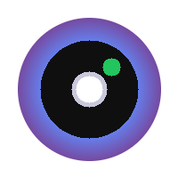
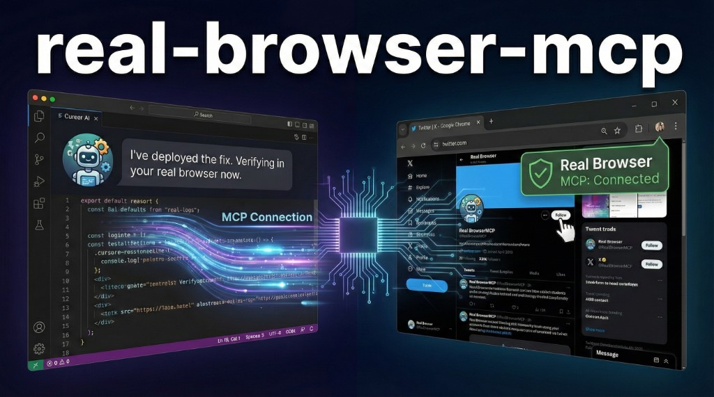

<p align="center">
  
</p>

<h1 align="center">real-browser-mcp</h1>

<p align="center">
  <strong>Agentic browsers give agents a new browser. Coding agents need yours.</strong>
</p>

<p align="center">
  MCP + Chrome extension for the Chrome you already have open:<br>
  cookies, SSO, staging sessions, the bug you already reproduced.
</p>

<p align="center">
  <a href="https://chromewebstore.google.com/detail/real-browser-mcp/fkkimpklpgedomcheiojngaaaicmaidi"></a>
  &nbsp;
  <a href="https://www.npmjs.com/package/real-browser-mcp"></a>
  &nbsp;
  <a href="cursor://anysphere.cursor-deeplink/mcp/install?name=real-browser&config=eyJjb21tYW5kIjoibnB4IiwiYXJncyI6WyIteSIsInJlYWwtYnJvd3Nlci1tY3AiXX0="></a>
  &nbsp;
  <a href="#-teach-your-agent"></a>
</p>

<p align="center">
  <a href="https://github.com/ofershap/real-browser-mcp/actions/workflows/ci.yml"></a>
  <a href="https://www.npmjs.com/package/real-browser-mcp"></a>
  <a href="https://www.npmjs.com/package/real-browser-mcp"></a>
  <a href="https://opensource.org/licenses/MIT"></a>
  <a href="https://agent-plugins.org"></a>
  <a href="https://www.typescriptlang.org/"></a>
</p>

<p align="center">
  
</p>

---

Everyone is building "agentic browsers." Most of them hand the agent a **new** browser: headless Chromium, a cloud VM, a clean profile with no cookies.

That is the wrong tool for the coding loop.

You ship a fix. The agent says "done, please verify."
You already have Chrome open on staging, past SSO, on the exact page that breaks.
The agent wrote the code. It could verify it there. It just cannot see that browser.

**real-browser-mcp** is the bridge: a local MCP server plus a Chrome extension over localhost WebSocket. Your agent talks MCP. Your real Chrome executes. Sessions stay on your machine.

This is not Playwright with a fresh profile. Not a hosted agent browser. Not CDP remote-debugging bolted onto your default Chrome profile (Chrome 136+ blocks that path for good security reasons).

<p align="center">
  
</p>

---

## Quick Start

Two parts:

- **MCP server** - runs on your machine, talks to your AI agent (Cursor, Claude Code, VS Code, …)
- **Chrome extension** - runs inside your real Chrome and executes the tools

### 1. Add the MCP server

**Cursor (one click):**

[](cursor://anysphere.cursor-deeplink/mcp/install?name=real-browser&config=eyJjb21tYW5kIjoibnB4IiwiYXJncyI6WyIteSIsInJlYWwtYnJvd3Nlci1tY3AiXX0=)

Or add manually in Cursor Settings > MCP > "Add new MCP server":

```json
{
  "mcpServers": {
    "real-browser": {
      "command": "npx",
      "args": ["-y", "real-browser-mcp"]
    }
  }
}
```

<details>
<summary>Claude Desktop, Windsurf, or other MCP clients</summary>

**Claude Desktop:** Edit `~/Library/Application Support/Claude/claude_desktop_config.json` (macOS) or `%APPDATA%\Claude\claude_desktop_config.json` (Windows). Add the same JSON block.

**Windsurf:** Settings > MCP. Same config.

Any MCP-compatible client works.

</details>

### 2. Install the Chrome extension

[](https://chromewebstore.google.com/detail/real-browser-mcp/fkkimpklpgedomcheiojngaaaicmaidi)

**Or load from source:**

```bash
git clone https://github.com/ofershap/real-browser-mcp.git
```

1. Open `chrome://extensions` and enable **Developer mode** (toggle in the top right)
2. Click **Load unpacked** and select the `extension/` folder from the cloned repo

Click the Real Browser MCP icon in your toolbar.

Green dot = connected. Gray = waiting for server.

Done. Your agent can see your browser.

---

## Agent Plugins

This repo ships as an [Agent Plugins](https://agent-plugins.org) **1.0.0** package: root `plugin.json`, `mcp.json`, and `skills/real-browser-control/` teach agents when to pick **real Chrome** over headless / cloud agentic browsers.

Claude Code `.claude-plugin/` and `agent-config/` remain for rules and marketplace flows. Agent Plugins is the cross-client layout (MCP + skill in one tree).

**Cursor (local plugin):** clone the repo, then copy or symlink it to `~/.cursor/plugins/local/real-browser-mcp` and reload the window. You still need the Chrome extension connected. One-click MCP install below adds only the server unless you also install the local plugin folder.

Spec and tooling: [agent-plugins.org](https://agent-plugins.org).

---

## Why this exists (the agentic browser gap)

| Stack | What the agent gets | Where it fails for coding agents |
|---|---|---|
| Playwright MCP / Puppeteer | New browser, clean state | No SSO cookies, no "the tab I already opened" |
| Cloud agentic browsers | Remote browser / VM | Separate login, not your IDE-local Chrome |
| Chrome DevTools MCP (CDP / autoConnect) | DevTools-oriented attach | Chrome 136+ refuses `--remote-debugging-port` on the **default** profile, so everyday logged-in Chrome is hard to attach without a throwaway profile |
| **Real Browser MCP** | **Your** Chrome via MV3 extension + localhost MCP | Not for CI parallel clean runs (use Playwright there) |

If you want repeatable automation in CI, use Playwright. If you want the agent inside the browser you already authenticated, use this.

---

## How Others Compare

| | Real Browser MCP | Playwright MCP | Chrome DevTools MCP | Cloud agentic browser |
|---|---|---|---|---|
| Browser | Your real Chrome | Launches new Chromium (usually) | Attach via CDP | Hosted / remote |
| Cookies / SSO already there | Yes | No (inject or replay) | Fragile on default profile after Chrome 136 | Separate session |
| Connection model | Extension ↔ localhost WebSocket | Playwright driver | Remote debugging / autoConnect | Vendor cloud |
| Best fit | Live verify in IDE | CI + repeatable runs | Performance / DevTools debugging | Unattended remote browse |
| Leaves your machine? | No control plane | Local (unless you add cloud) | Local | Yes |

---

## 🧠 Teach Your Agent

The agent can use all 18 tools out of the box, but it works better when it knows _when_ and _how_ to chain them. A config file teaches the right workflow - snapshot first, then act, then verify.

Run one command:

```bash
npx real-browser-mcp --setup cursor
```

This installs:
- `~/.cursor/rules/real-browser-mcp.mdc` - teaches the snapshot-first workflow, how to handle dropdowns, when to use screenshots vs snapshots
- `~/.cursor/commands/check-browser.md` - adds `/check-browser` to your Cursor chat

After that, type `/check-browser` in any chat. Or just say "check the result in my browser" and the agent knows what to do.

<details>
<summary>Claude Code setup</summary>

```bash
npx real-browser-mcp --setup claude
```

Adds an `AGENTS.md` to your project root. Claude Code auto-discovers it.

</details>

See [`agent-config/`](agent-config/) for manual installation or to customize the rules.

---

## What It Can Do

18 tools. Grouped by purpose.

**See**

| Tool | What it does |
|------|-------------|
| `browser_snapshot` | Accessibility tree with element refs. Compact mode (default) returns only interactive elements |
| `browser_screenshot` | Capture what's on screen |
| `browser_text` | Extract raw text from page or element |
| `browser_find` | Query elements by CSS selector |

**Interact**

| Tool | What it does |
|------|-------------|
| `browser_click` | Click by ref or CSS selector |
| `browser_click_text` | Click by visible text. Works through React portals and overlays |
| `browser_type` | Type into inputs and contenteditable fields |
| `browser_press_key` | Key combos (Enter, Escape, Ctrl+A) |
| `browser_scroll` | Scroll pages and virtual containers |
| `browser_hover` | Trigger tooltips and dropdowns |
| `browser_select` | Pick from native `<select>` dropdowns |
| `browser_wait` | Wait for elements to appear or disappear |

**Navigate**

| Tool | What it does |
|------|-------------|
| `browser_navigate` | Go to a URL in the active tab |
| `browser_tabs` | List, create, close, or focus tabs |

**Debug**

| Tool | What it does |
|------|-------------|
| `browser_console` | Console output (log, warn, error) |
| `browser_network` | XHR/fetch requests with status codes |
| `browser_evaluate` | Run JavaScript via Chrome DevTools Protocol |
| `browser_handle_dialog` | Handle alert/confirm/prompt dialogs |

---

## Configuration

| Env var | Default | What it does |
|---------|---------|-------------|
| `WS_PORT` | `7225` | WebSocket port for extension connection |

Connection drops are handled automatically with exponential backoff (1s to 30s), ping/pong health checks every 10s, and per-tool timeouts (5s for clicks, 60s for navigation).

<details>
<summary>Multiple Chrome profiles</summary>

Run two server instances on different ports:

```json
{
  "mcpServers": {
    "browser-work": {
      "command": "npx", "args": ["-y", "real-browser-mcp"]
    },
    "browser-personal": {
      "command": "npx", "args": ["-y", "real-browser-mcp"],
      "env": { "WS_PORT": "9333" }
    }
  }
}
```

Update the port in each extension popup to match.

</details>

---

<details>
<summary><strong>Architecture</strong></summary>

Everything stays on your machine. The extension connects to the MCP server via WebSocket on localhost. No cloud, no proxy, nothing leaves your browser.

```
real-browser-mcp/
├── mcp-server/          MCP server (npm package, TypeScript)
│   └── src/tools/       One file per tool, registry pattern
├── extension/           Chrome extension (Manifest V3, plain JS)
│   ├── background.js    Service worker, WebSocket client, tool handlers
│   ├── content.js       Console capture
│   └── popup/           Connection status UI
├── agent-config/        Pre-built configs for Cursor + Claude Code
│   ├── cursor/          Rules and commands
│   ├── skills/          Browser automation skill
│   └── setup.mjs        One-command installer
└── tests/               Bridge + registry tests
```

**Stack:** TypeScript (strict) · MCP SDK · WebSocket · Chrome Extension Manifest V3 · Vitest

</details>

<details>
<summary><strong>Development</strong></summary>

```bash
git clone https://github.com/ofershap/real-browser-mcp.git
cd real-browser-mcp
npm install
npm run build
npm test
```

| Command | What it does |
|---------|-------------|
| `npm run build` | Compile TypeScript |
| `npm run dev` | Watch mode |
| `npm test` | Run tests |
| `npm run typecheck` | Type check without emitting |
| `npm run setup:cursor` | Install Cursor rule + command |

</details>

## FAQ

### Is this an agentic browser?

No. An agentic browser usually means the agent owns a new browser (local headless or cloud). real-browser-mcp connects an MCP agent to **your existing Chrome**. Same profile, same tabs, same logins.

### Is the Chrome extension required?

Yes. The MCP server alone cannot see or control Chrome. Install the [Chrome extension](https://chromewebstore.google.com/detail/real-browser-mcp/fkkimpklpgedomcheiojngaaaicmaidi), open the popup, and wait for a green connected state before calling tools.

### Does it work with my existing logins and corporate SSO?

Yes. The extension runs in your normal Chrome profile with cookies, sessions, and local storage. That is the point: verify against the session you already set up, including SSO you completed manually.

### How is this different from Playwright MCP or browser-use?

Those stacks are built around a browser the automation tool launches (great for CI and clean repeats). Real Browser MCP is built around the browser you already have open. Use Playwright when you need deterministic runs. Use this when you need live session state.

### How is this different from Chrome DevTools MCP?

Chrome DevTools MCP is excellent for DevTools-style debugging and can attach via CDP / autoConnect. After Chrome 136, remote debugging on the **default** user profile is blocked, which is exactly the profile that holds your real logins. Real Browser MCP uses an extension bridge over localhost WebSocket instead of opening a debug port on that profile.

### Why not a cloud agentic browser?

Cloud browsers are remote machines. You re-auth, you leave the local IDE loop, and session data sits on someone else's infra. This project keeps control on localhost: MCP server ↔ extension. Page content still enters your AI client when tools return it; there is just no vendor browser SaaS in the middle.

### Agent Plugins vs MCP-only install?

MCP-only (Cursor deeplink or `mcp.json`) registers the server and tools. The Agent Plugins package adds `plugin.json` and the `real-browser-control` skill so agents know when to prefer real Chrome over headless. Same npm server either way.

### Is it safe to let an agent control my real browser?

The server and extension talk over WebSocket on localhost only; nothing is sent to a cloud control plane. The agent can still click, type, and read whatever is visible in the connected tab, including logged-in apps. Use a dedicated profile or tab when testing untrusted sites, and do not point automation at tabs with sensitive data unless you accept that risk.

<details>
<summary>Does it send data anywhere?</summary>

No. The MCP server and extension talk over WebSocket on localhost. Nothing leaves your machine. There is no analytics, no telemetry, and no cloud component. [Privacy policy.](PRIVACY.md)

</details>

<details>
<summary>Which AI clients work?</summary>

Any MCP-compatible client. Cursor, Claude Desktop, Claude Code, Windsurf, Cline, and anything else that speaks the MCP protocol.

</details>

<details>
<summary>Can I use it with multiple Chrome profiles?</summary>

Yes. Run two MCP server instances on different ports. See [Configuration](#configuration) for the setup.

</details>

---

## Contributing

Bug reports, feature requests, and PRs welcome. Open an issue first for larger changes.

## Author

[](https://gitshow.dev/ofershap)

[](https://linkedin.com/in/ofershap)
[](https://github.com/ofershap)


---

<sub>README built with [README Builder](https://ofershap.github.io/readme-builder/)</sub>

## License

[MIT](LICENSE) &copy; [Ofer Shapira](https://github.com/ofershap)
